# 生物统计学与R手札

[TOC]

## 目录

* [Introduction](#Introduction)

* [参数检验与非参数检验](#参数检验与非参数检验)

  * [假设检验的步骤](#假设检验的步骤)
  * [单样本参数校验](#总体的单样本参数检验)
  * [类型1和类型2错误](#类型1和类型2错误)
  * [两样本参数检验](#两样本参数检验)
  * [非参数检验](#非参数检验)
  * [多重检验矫正](#多重检验矫正)

* [方差分析](#方差分析)

  * [单因素方差分析](#单因素方差分析)
  * [KW检验](#方差分析非参数检验)
  * [两因素方差分析](#两因素方差分析)
  * [随机效应模型两因素方差分析](#随机效应模型的两因素方差分析)
  * [混合模型两因素方差分析](#混合模型的两因素方差分析)
  * [**小结**](#小结)
  * [缺失值处理](#缺失值处理)

* [回归分析](#回归分析)

  * [线性回归](#线性回归)
  * [非线性回归](#非线性回归)
  * [相关分析](#相关分析)
  * [多元线性回归](#多元线性回归)
  * [逻辑回归](#逻辑回归)
  * [偏相关与多重相关](#部分相关与多重相关)

  ​

## Introduction

生物统计学：是统计学在生物学中的应用，是用数理统计的原理和方法来分析解释生命现象的一门科学，是研究生命过程中以样本推断总体的一门科学。

以数理统计原理为基础，应用到生物实验设计和分析领域，这便形成了生物统计学科的框架。所以学习过程是一般在学习概率论与数理统计的同时，对生物领域的实例进行相应分析和解读。

统计分析的流程：

- 设计或形成假设
- 设计相应的实验
- 收集数据
- 分析总结数据
- 形成推断

这与一般的科学研究过程是相同的，实质上生物科学研究的分析过程也就是生物统计分析的实例化。

数据的来源：
$$
Source-of-data 
\begin{cases}
Records    \\
Surveys  \begin{cases} Comprehensive \\ Sample\\\end{cases}  \\
Experiment  \\
\end{cases}
$$
统计学上经常涉及到变量这个概念，它是指**一种体现在不同对象上有不同数值的特征量**，比如人的心率，对象是人，不同的人心率不一样，构成了心率的数值集。

变量有可以分为数值型变量和分类变量，前者通常指能够被测量的数值量，比如身高体重；后者一般指不能被数值化，通过评估生成的变量，比如视力的好坏，病人病情等级等，又可以依据是否有序分为连续型和非连续型变量，比如病人等级从低到高分为几类，这里就包含了变量的顺序(Rank)信息。

总体 *population*： 感兴趣的随机变量的数据总集。 	

样本 *sample*：  总体的抽样。

**注意**：采样尽量为保持一种随机的过程，这是在设计实验时非常需要注意的，不然结果不可靠。

几种采样方式：

- **随机采样**： 通过计算机生成的伪随机数抽取相应的数据；
- **系统采样**： 将数据排序，每隔K个抽取一个数据；
- **Convenience Sampling**： 哪个方便用哪个；
- **分层抽样**： 将总体按相同特征分为至少两类，在类别中分别抽样。
- ......

上述抽样方法详细介绍及优缺点可以参考[百度百科](http://baike.baidu.com/item/%E6%8A%BD%E6%A0%B7%E8%B0%83%E6%9F%A5%E6%B3%95)。

**统计量是样本的描述量；参数是总体的描述量。**

概率相关的基本概念大都不难，理解即可。需要注意的是贝叶斯公式，它在当今各大领域都非常常用，值得深挖。


常见概率分布统计书上都有详细介绍，用的时候查询即可。

因为我们常用的数据都很难直接满足正态分布，单为什么用正态分布去理解和计算呢，这里有两个定理概念需要理解：

- **大数定理**就是样本均值在总体数量趋于无穷时依概率收敛于样本均值的数学期望（可不同分布）或者总体的均值（同分布）。
- **中心极限定理**就是一般在同分布的情况下，样本值的和在总体数量趋于无穷时的极限分布近似于正态分布。

**参数估计**

点估计是以抽样得到的样本指标作为总体指标的估计量，并以样本指标的实际值直接作为总体未知参数的估计值的一种推断方法；区间估计则是根据抽样指标和抽样平均误差推断总体指标的可能范围，它既说明推断的准确程度，同时也表明了推断结果的可靠程度。可见，点估计所推断的总体指标是一个确定的数值，而区间估计所推断的总体指标是一个数值域，这个值域受样本指标、极限误差和样本单位数等因素的影响。                        

- **点估计**（Point Estimate）

  [http://wiki.mbalib.com/wiki/点估计](http://wiki.mbalib.com/wiki/%E7%82%B9%E4%BC%B0%E8%AE%A1)

  [http://baike.baidu.com/view/635268.htm](http://baike.baidu.com/view/635268.htm)

  **区间估计**（Interval Estimation）/**置信区间**（Confidence interval）

  [http://wiki.mbalib.com/wiki/置信区间](http://wiki.mbalib.com/wiki/%E7%BD%AE%E4%BF%A1%E5%8C%BA%E9%97%B4)

  [http://baike.baidu.com/view/364109.htm](http://baike.baidu.com/view/364109.htm)

- 在置信度为$1-\alpha$置信度下的

  - 区间估计写为：$\hat{p}-E <p<\hat{p}+E$，点估计写为$p=\hat{p}\pm E$
  - E为误差限，$E=Z_{\alpha/2}\sqrt{\frac{\hat{p}\hat{q}}{n}}$
  - 由上述公式可以推出所需要的样本大小$n=\frac{(Z_{\alpha}/2)^2\hat{p}\hat{q}}{E^2}$
  - 总体方差已知时，估计均值$\mu$使用z分布（u分布），$E=Z_{\alpha/2}\frac{\sigma}{\sqrt{n}}$,$n=[\frac{(Z_{\alpha}/2) \sigma}{E}]^2$
  - 总体方差未知时，估计均值$\mu$使用t分布，$t=\frac{\overline{x}-\mu}{\frac{s}{\sqrt{n}}}$，$E=t_{\alpha}/2\frac{s}{\sqrt{n}}$，$df=n-1$

- 方差估计

  - 卡方分布：$\chi^2=\frac{(n-1)s^2}{\sigma^2}$，$n=sample \quad size,s^2=sample \quad variance, \sigma^2=population \quad variance$
  - 方差的区间估计为$\frac{(n-1)s^2}{\chi_R^2}<\sigma^2<\frac{(n-1)s^2}{\chi_L^2}$

***

## 参数检验与非参数检验

统计中常常提到p值，它的实质是一个小概率事件发生的概率大小值。例如说某件事情的$p<0.05$指的是这件事情发生的概率不超过0.05，因为它发生的概率极小，所以在一般的实验（试验）中，很难碰到这样的事情。因此，当我们碰到这样的事情时，术语说这是一件显著的事情（$p<0.01$为极其显著）。实际实验过程中如果数据噪声服从高斯分布（正态分布），这样的事情应当不会发生（概率很小嘛），那么就应该是其他因素导致的。比如说两组数据进行对比时，如果这两组样本是从同一个总体抽出来的，就应该没什么差异（一般用总体均值$\mu$的假设检验）；如果两组样本经过不同的处理，发现有显著差异（概率很小的事情发生了），说明这两组不同处理的样本映射为不同的总体，我们以此结果来推断两个不同处理的总体它们之间有显著性的差异（所以说实验才是可以重复的，因为每次实验都是对总体的抽样）。

### 假设检验的步骤

一般包括以下四个步骤：

1. 提出假设：一般做两个彼此独立的假设，一个是无效假设或零假设（null hypothesis 很常用），记做$H_0$；另一个是备择假设，称为$H_A$。所谓的无效意指处理效应与总体参数之间没有真实的差异，实验结果中的差异是误差导致的。
2. 确定显著水平：常用$\alpha=0.05  \quad or \quad\alpha=0.01$
3. 计算概率（p值）：有双尾和单尾两种
4. 推断是否接受假设

这方面的知识网上很多，可以参考[百度百科](http://baike.baidu.com/link?url=NY0VUNmmZvwxKiioiUIKaO_qc2tJAlGCa72-nnPg9jv1GIzkmTQomzJYtlYhhUhqIPkJSJWNUU0aNEz1bfpzdx7y0KzR3QyBbpQQWQ9BqceoE63I6-AJpqh7u1brPvU7)或其他资料。

### 总体的单样本参数检验

**总体方差已知时对总体均值检验**

如果总体方差已知，使用z分布（标准正态分布）进行计算


**总体方差未知时对总体均值进行检验**

如果总体方差未知，使用t分布进行计算


（修正一下，上图总体方差未知，sigma应该用样本标准差s替代）

计算时根据要求，算出z值或者t值，然后与置信度（t分布需要看自由度）下的z（或t）统计量进行对比。观察是在否定区间还是接受区间，从而完成对假设的推断。

当检验是单边时，上述公式的$1-\alpha/2$变成$1-\alpha$

在R中，统计量与分布的计算和图形的绘制可能涉及到的一些函数的使用，可以参考[数值与字符处理函数](http://www.jianshu.com/p/259a1ed171a4)，[基本统计分析](https://moiedotblog.wordpress.com/2017/04/29/%e5%9f%ba%e6%9c%ac%e7%bb%9f%e8%ae%a1%e5%88%86%e6%9e%90/)，[基本图形绘制](https://moiedotblog.wordpress.com/2017/04/29/%e4%bd%bf%e7%94%a8r%e7%bb%98%e5%88%b6%e5%9f%ba%e6%9c%ac%e5%9b%be%e5%bd%a2/)。

以下是常用的概率函数


它的使用概率函数形如：`[dpqr] distribution_abbreviation()`

前面一部分是选择计算哪种类型（是概率函数还是分布函数..），后面一部分是指定使用的分布。

比如说`qt()`就是计算t分布的分位数函数，函数具体的参数调用可以使用`help()`进行查询。

在对单样本的总体方差进行检验时，常用卡方分布，两样本则用F分布。

公式分别为：			$\chi^2=\frac{(k-1)s^2}{\sigma^2} \quad df=k-1$

​					$F=\frac{s_1^2}{s_2^2}\quad df_1=n_1-1,df_2=n_2-1$

注意，卡方分布不仅可以用来检验方差同质性，还可以进行适合性和独立性检验，后两者用来判断实际观测值与理论观测值的偏离程度。

当对总体频率进行检验时，如果不满足中心极限定理，则不可以用正态分布进行检验，转而使用二项分布进行检验。

**小结：**

One sample parametric test usually assumes that samples are randomly selected from normal distribution.

- ✤ (1) The mean of a normal distribution with unknown variance (one-sample t test)
- ✤ (2) The mean of a normal distribution with known variance (one-sample z test)
- ✤ (3) The variance of a normal distribution (one-sample 2 test)
- ✤ (4) The parameter p of a binomial distribution (one-sample binomial test)


### 类型1与类型2错误

**两种类型错误及其关系**

```
第一类错误(typeⅠerror)，Ⅰ型错误，拒绝了实际上成立的H0，，即错误地判为有差别，这种弃真的错误称为Ⅰ型错误。其概率大小用即检验水准用α表示。α可取单尾也可取双尾。假设检验时可根据研究目的来确定其大小，一般取0.05，当拒绝H0时则理论上理论100次检验中平均有5次发生这样的错误.。
第二类错误(typeⅡ error)。Ⅱ型错误，接受了实际上不成立的H0 ，也就是错误地判为无差别，这类取伪的错误称为第二类错误。第二类错误的概率用β表示，β的大小很难确切估计。
二者的关系是，当样本例数固定时，α愈小，β愈大；反之，α愈大，β愈小。因而可通过选定α控制β大小。要同时减小α和β，唯有增加样本例数。统计上将1-β称为检验效能或把握度(power of a test)，即两个总体确有差别存在，而以α为检验水准，假设检验能发现它们有差别的能力。实际工作中应权衡两类错误中哪一个重要以选择检验水准的大小。
```

由此引申出几个公式概念，包括灵敏度、特异性、假阳性率等，它们的计算方式如下：


这些概念常用来计算ROC曲线，该曲线在评判模型的有效性中非常流行。

简单地讲，ROC曲线描绘了灵敏性（真阳性率）随假阳性率（1-特异性）的变化趋势。

AUC则是指ROC曲线下方围成的面积，数值越大，分类器（模型）效果越好。

详细参考：[ROC曲线概念](http://blog.sina.com.cn/s/blog_493b40e10100jps5.html)；[ROC和AUC介绍以及如何计算AUC](http://alexkong.net/2013/06/introduction-to-auc-and-roc/)

**功效**（真阳性率），如果功效过低，那么就算处理不同导致有显著性差异也很难检测出来，所以在进行检验时，我们需要对它进行控制。

**统计检验的功效计算**（分别使用与正态分布、t分布与样本频率检验）


效应值： $\frac{|\mu_0 - \mu_1|}{\sigma}$，表示两个总体的平均值差异

功效分析可以帮助在给定置信度的情况下，判断检测到给定效应值所需的样本量。反过来，它也可以帮助你在给定置信度水平情况下，计算在某个样本量内能检测到给定效应值的概率。如果概率低得难以接受，修改或放弃这个实验将是一个明智的选择。

在研究过程时，研究者通常关注四个量：样本大小、显著性水平、功效和效应值。

- 样本大小指实验设计中每种条件中观测的数目。
- 显著性水平（也称为alpha）由I型错误的概率来定义。也可以把它看作发现效应不发生的概率。
- 功效通过1减去II型错误的概率来定义。可以把它看作真实效应发生的概率。
- 效应值指的是在备择或研究假设下效应的值。效应值的表达值依赖于假设检验中使用的统计方法。

四个量紧密相关，给定其中任意三个量，便可以推算第四个量。

我们常常会使用到t分布检验相关的功效分析，这里有一篇值得参考的博文[找出t检验的效应大小，对耍流氓 say no！](http://mp.weixin.qq.com/s?__biz=MzAxMDA4NjU3OA==&mid=2652548856&idx=1&sn=f4d2d21a3bce3f6e34a7d7a99315c004&scene=21)。

功效分析使用到的一些函数和包可以参考[R语言中的功效分析](https://moiedotblog.wordpress.com/2017/04/29/r%e8%af%ad%e8%a8%80%e4%b8%ad%e7%9a%84%e5%8a%9f%e6%95%88%e5%88%86%e6%9e%90/)。

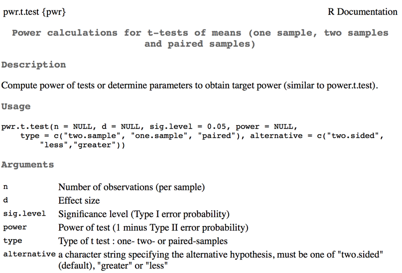


### 两样本参数检验


图中$\delta=|\mu_1-\mu_2|$

功效分析和相关检验可以参考上一节。


### 方差分析非参数检验

非参数检验(Nonparametric tests)是统计分析方法的重要组成部分，它与参数检验共同构成统计推断的基本内容。参数检验是在[总体分布](http://baike.baidu.com/item/%E6%80%BB%E4%BD%93%E5%88%86%E5%B8%83)形式已知的情况下，对总体分布的参数如[均值](http://baike.baidu.com/item/%E5%9D%87%E5%80%BC)、[方差](http://baike.baidu.com/item/%E6%96%B9%E5%B7%AE)等进行推断的方法。但是，在数据分析过程中，由于种种原因，人们往往无法对总体分布形态作简单假定，此时参数检验的方法就不再适用了。非参数检验正是一类基于这种考虑，在总体方差未知或知道甚少的情况下，利用样本数据对总体分布形态等进行推断的方法。由于非参数检验方法在推断过程中不涉及有关总体分布的参数，因而得名为“非参数”检验。

也就是说，之前的参数检验，我们在对数据分析之前，需要假定该数据的总体服从某种分布，而这些分布的假定是需要前提条件的，其中最重要的是正态性，而往往我们的数据很难达到这样的要求，甚至对于总体的分布完全一无所知。这个时候我们就可以使用非参数检验。（当然两者之间的优缺点对比还有很多）

一般来说，能用参数检验尽量使用参数检验，因为它的统计效力远高于非参数检验，这也是为什么t检验在文献中非常流行的原因。

非参数检验的种类非常之多，可以参考[百度百科](http://baike.baidu.com/link?url=rw2WQE3crM7Mxlw2sGbvo8A40pLNyAt0CG9smzzEk4iUcxCH5uMoNG2GvTiGl9FKrzwOusid2CfkKw6Oi-KFDIMZqlB_xQeebz2RGsB60fvkg1pVyVLgyjXM1H4fLpb9YfPeH-egOiq_jMFH5eiN-a)，其中常用的是符号检验与符号秩检验。

下表汇出了对总体均值进行检验时，参数和非参数的常用检验对比。

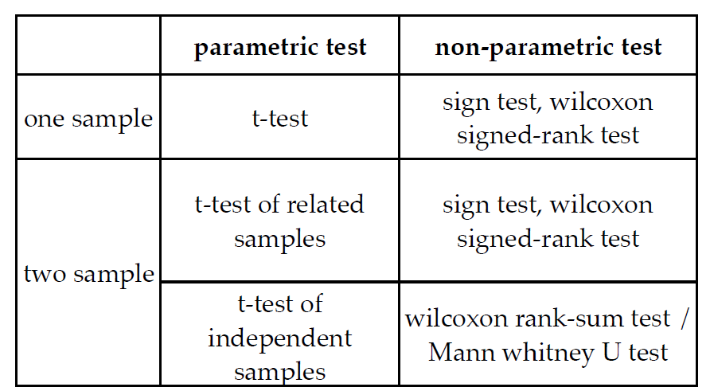

符号检验与秩和检验两种方法相比较，符号检验只考虑样本差数的符号；秩和检验考虑样本差数的符号和样本差数的顺序。

符号检验法是通过两个相关样本的每对数据之差的符号进行检验，从而比较两个样本的显著性。具体地讲，若两个样本差异不显著，正差值与负差值的个数应大致各占一半。

符号检验与参数检验中相关样本显著性[t检验](http://wiki.mbalib.com/wiki/T%E6%A3%80%E9%AA%8C)相对应，当资料不满足参数检验条件时，可采用此法来检验两相关样本的差异显著性。(http://wiki.mbalib.com/wiki/%E7%AC%A6%E5%8F%B7%E6%A3%80%E9%AA%8C)

秩和检验方法最早是由维尔克松提出，叫维尔克松两样本检验法。后来曼—惠特尼将其应用到两[样本容量](http://wiki.mbalib.com/wiki/%E6%A0%B7%E6%9C%AC%E5%AE%B9%E9%87%8F)不等的情况，因而又称为曼—惠特尼U检验。这种方法主要用于比较两个独立样本的差异。(http://wiki.mbalib.com/wiki/%E7%A7%A9%E5%92%8C%E6%A3%80%E9%AA%8C)

**曼-惠特尼U检验**又称“**曼-惠特尼秩和检验**”，是由[H.B.Mann](http://wiki.mbalib.com/w/index.php?title=H.B.Mann&action=edit)和[D.R.Whitney](http://wiki.mbalib.com/w/index.php?title=D.R.Whitney&action=edit)于1947年提出的。它假设两个样本分别来自除了总体均值以外完全相同的两个[总体](http://wiki.mbalib.com/wiki/%E6%80%BB%E4%BD%93)，目的是检验这两个总体的均值是否有显著的差别。

曼-惠特尼秩和检验可以看作是对两均值之差的参数检验方式的[T检验](http://wiki.mbalib.com/wiki/T%E6%A3%80%E9%AA%8C)或相应的大样本正态检验的代用品。由于曼-惠特尼秩和检验明确地考虑了每一个[样本](http://wiki.mbalib.com/wiki/%E6%A0%B7%E6%9C%AC)中各测定值所排的秩，它比[符号检验法](http://wiki.mbalib.com/wiki/%E7%AC%A6%E5%8F%B7%E6%A3%80%E9%AA%8C%E6%B3%95)使用了更多的[信息](http://wiki.mbalib.com/wiki/%E4%BF%A1%E6%81%AF)。(http://wiki.mbalib.com/wiki/%E6%9B%BC-%E6%83%A0%E7%89%B9%E5%B0%BCU%E6%A3%80%E9%AA%8C)

上述文字后链接都有详细介绍和实例。


### 多重检验矫正

数据分析中常碰见多重检验问题(multiple testing).Benjamini于1995年提出一种方法,通过控制FDR(False Discovery Rate)来决定P值的域值。
假设你挑选了R个差异表达的基因，其中有S个是真正有差异表达的，另外有V个其实是没有差异表达的，是假阳性的.实践中希望错误比例Q＝V/R平均而言不能超过某个预先设定的值（比如0.05），在统计学上，这也就等价于控制FDR不能超过5％.
根据Benjamini在他的文章中所证明的定理，控制fdr的步骤实际上非常简单。
设总共有m个候选基因，每个基因对应的p值从小到大排列分别是p(1),p(2),...,p(m),则若想控制fdr不能超过q，则只需找到最大的正整数i，使得 p(i)<= (i*q)/m.然后，挑选对应p(1),p(2),...,p(i)的基因做为差异表达基因，这样就能从统计学上保证fdr不超过q。  

**Bonferroni校正 **　　
如果在同一数据集上同时检验n个独立的假设，那么用于每一假设的统计显著水平，应为仅检验一个假设时的显著水平的1/n。举个例子：如要在同一数据集上检验两个独立的假设，显著水平设为常见的0.05。此时用于检验该两个假设应使用更严格的0.025。即0.05* (1/2)。该方法是由Carlo Emilio Bonferroni发展的，因此称Bonferroni校正。 
这样做的理由是基于这样一个事实：在同一数据集上进行多个假设的检验，每20个假设中就有一个可能纯粹由于概率，而达到0.05的显著水平。

**FDR计算**


## 方差分析

### 单因素方差分析

分析流程：

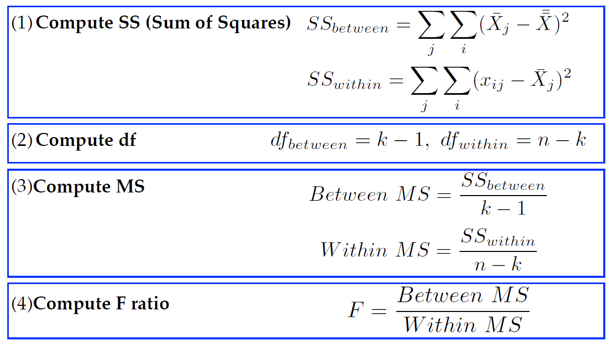

形成列联表


课件8中有一个step-by-step ANOVA按步骤进行单因素方差分析计算。

R中一步搞定可以使用`aov()`与`lm()`函数。[参考](https://moiedotblog.wordpress.com/2017/04/29/%e6%96%b9%e5%b7%ae%e5%88%86%e6%9e%90/)

方差分析主要用于两个及以上不同组实验的分析，探究整体是否存在显著性，如果存在显著性差异，进一步需要配对t检验找出存在差异的组。

R一个非常好用的函数是`TukeyHSD()`。检测方差同质性则使用`bartlett.test()`，`leveneTest()`函数。

单因素方差分析可以用`oneway.test()`函数，设定方差相等时与`aov()`结果相同。

做方差分析时，需要注意使用的模型(https://wenku.baidu.com/view/5516ebcabe23482fb5da4c5b.html)。大致分为三类：固定效应模型，随机效应模型以及混合效应模型。该概念在李春喜《生物统计学》88页有详细介绍。

简单来说，固定模型指各个处理的效应是一个固定的常量，比如不同温度条件下小麦籽粒的发芽实验，处理的水平（温度）是特意选择的，所以得到的结论也仅限于所选定的这几个水平；随机效应指各处理的效应是随机因素，比如不同纬度下桃树对地理条件的适应情况，由于气候、土壤等条件无法人为控制，属于随机因素，就需要随机模型来处理。从而实验所得出的结论可以推广到随机因素的所有水平上。混合模型即为前两者的叠加。

不同的模型在平方和和自由度的计算是相同的，但是假设检验时F值得计算公式是不同的。模型分析的侧重点也不同。对于单因素方差分析来说，固定模型与随机模型无多大区别。


### 非参数检验

与t检验类似，方差分析中面对方差不同质或者所处理的数据是有序性而不是数值型时无能为力。因此需要相应的非参数检验来解决这样一类问题。Kruskal-Walls test就是为这个目的开发的。它就像多重样本（multiple-sample）版本的Wilcoxon秩和检验一样。


下面截一个实例（对于前面的公式看，比较容易理解）。

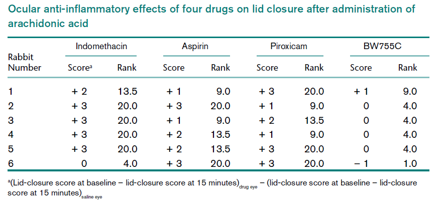


在R中，使用函数`kruskal.test()`即可用进行K-W检验。

一但拒绝原假设（有显著性差异），接着使用`pairwise.wilcox.test()`进行两两配对检验，可用指定矫正方法。

### 两因素方差分析

单因素方差分析指一个处理水平，两因素方差分析指两个，多个因素的分析类似。

比如探究某几种药物对某种病（比如癌症）的治疗效果，这个是单因素的，如果我们将病人按性别分为两类，这时就会多出一个性别因素，构成了两因素的方差分析（药物和性别对癌症治疗效果的影响）。

说实话，这个理解不难，手工计算就比较麻烦了。在R中使用函数加上公式可以很容易地表达因变量和自变量的关系，从而完成方差分析。

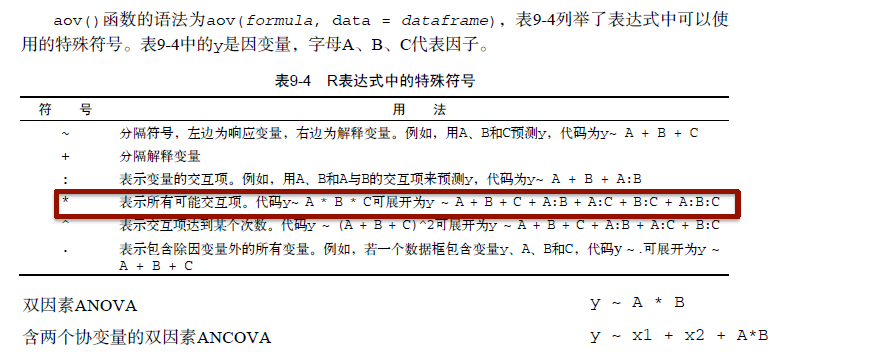

下面只截取相应的公式（分随机和固定效应模型）

#### 两因素重复测量方差分析


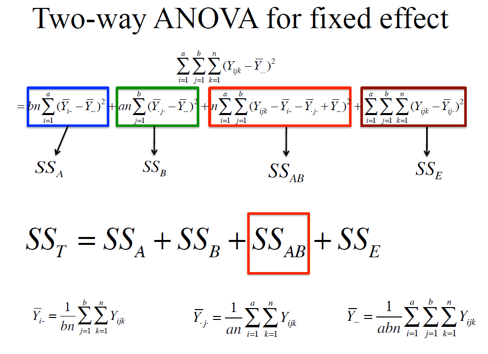


如果存在显著性差异，在R中使用`TukeyHSD()`函数计算两两之间的显著性。

#### 无重复测量两因素方差分析

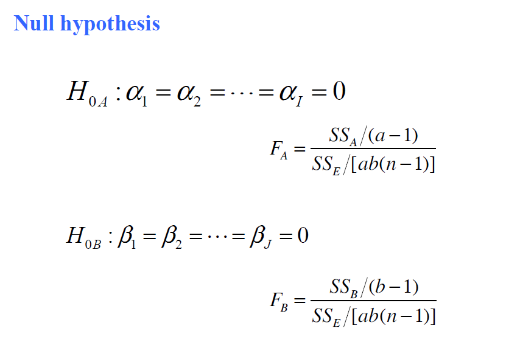

这个其实相当于重复测量的简化版了。少了一个假设条件，之前的公式同样适用但是没有了多个测量值计算平均数等一些计算。

### 随机效应模型的两因素方差分析


### 混合模型的两因素方差分析


### 小结


也许方差分析中涉及到的公式略显复杂，计算难度也有很大提升。但是就一个使用者而言，应当理解它的基本内涵和适用范围：它是利用F检验对两个或者两个以上样本的参数检验手段，需要同t检验（可能相对的非参数检验）结合使用；从而完成从多个样本中探寻某些因素对于两个样本之间的影响的过程。它的分析流程如下：

我之前学习时有记录一些方差分析的实例，可以通过[wordpress链接-方差分析](https://moiedotblog.wordpress.com/2017/04/29/%e6%96%b9%e5%b7%ae%e5%88%86%e6%9e%90/)到相关博文进行查看。


### 缺失值处理

这里涉及一些方法和相应的R包，估计需要时查看说明。


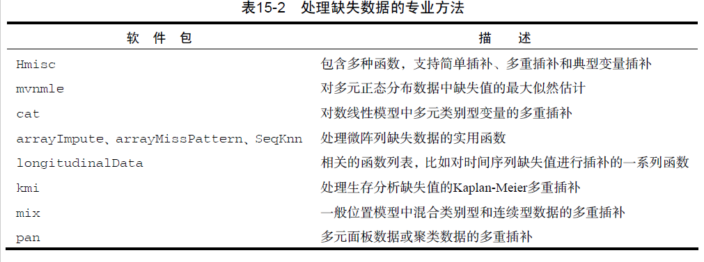


## 回归分析

从许多方面来看，**回归分析**是统计学的核心。它其实是一个广义的概念，通指那些用一个或多个预测变量（也称为自变量或解释变量）来预测响应变量（也成因变量、效标变量或结果变量）。

**回归**是一个令人困惑的词，因为它有许多特异的变种。R提供了相应强大而丰富的功能同样令人困惑。有统计表明，R中做回归分析的函数已经超过200个。（回归分析相关R的一些概念和函数、包的操作请链接到[wordpress-回归分析](https://moiedotblog.wordpress.com/2017/04/29/%e5%9b%9e%e5%bd%92%e5%88%86%e6%9e%90/)查看和了解。）

**方差分析与回归分析的区别与联系**

```
方差分析与回归分析是有联系又不完全相同的分析方法。方差分析主要研究各变量对结果的影响程度的定性关系，从而剔除对结果影响较小的变量，提高试验的效率和精度。而回归分析是研究变量与结果的定量关系，得出相应的数学模式。在回归分析中，需要对各变量对结果影响进行方差分析，以剔除影响不大的变量，提高回归分析的有效性。
方差分析(Analysis of Variance，简称ANOVA)，又称“变异数分析”，是R.A.Fisher发明的，用于两个及两个以上样本均数差别的显著性检验。 由于各种因素的影响，研究所得的数据呈现波动状。造成波动的原因可分成两类，一是不可控的随机因素，另一是研究中施加的对结果形成影响的可控因素。方差分析是从观测变量的方差入手，研究诸多控制变量中哪些变量是对观测变量有显著影响的变量。
回归分析是研究各因素对结果影响的一种模拟经验方程的办法，回归分析（regression analysis)是确定两种或两种以上变量间相互依赖的定量关系的一种统计分析方法。运用十分广泛，回归分析按照涉及的变量的多少，分为一元回归和多元回归分析。
回归分析中，会用到方差分析来判断各变量对结果的影响程度，从而确定哪些因素是应该纳入到回归方程中，哪些由于对结果影响的方差小而不应该纳入到回归方程中。
```

### 线性回归

我们的重点是**普通最小二乘（OLS）回归法**，包括简单线性回归、多项式回归和多元线性回归。

OLS回归是通过预测变量的加权和来预测量化的因变量，其中权重是通过数据估计而得到的参数。


（图片中几个字打错了......）

线性回归非常简单，高中知识便有相关的解法介绍。科学研究也较为常用，它是通过对数据计算最小残差平方和来寻找自变量与因变量之间是否存在线性关系。在R中，`aov()`函数以及`lm()`函数（常用后者，前者一般用来做方差分析）都会用来计算线性回归。

忽略推导过程，计算相关系数和截距的公式为：


R的用法很简单，格式为`myfit <- lm(formula,data)`

公式的构建类似于方差分析，下面列出常用的符号：

| 符号            | 用途                                 |
| ------------- | ---------------------------------- |
| ~             | 分隔符号，左边为响应变量（因变量），右边为解释变量（自变量）     |
| +             | 分隔预测变量（因变量）                        |
| :             | 表示预测变量的交互项                         |
| *             | 表示所有可能交互项的简洁方式                     |
| ^             | 表示交互项达到某个次数                        |
| .             | 表示包含除因变量外的所有变量                     |
| –             | 减号，表示从等式中移除某个变量                    |
| -$\mathtt{l}$ | 删除截距项                              |
| $I()$         | 从算术的角度来解释括号中的元素                    |
| function      | 可在表达式中用的数学函数。例如，log(y) ~ x + z + w |

除了`lm()`，下表列出了一些有用的分析函数，对拟合得到的模型做进一步的处理和分析。

| 函数             | 用途                                 |
| -------------- | ---------------------------------- |
| summary()      | 展示拟合模型的详细结果                        |
| coefficients() | 列出拟合模型的模型参数                        |
| confint()      | 提供模型参数的置信区间（默认95%)                 |
| fitted()       | 列出拟合模型的预测值                         |
| residuals()    | 列出拟合模型的残差值                         |
| anova()        | 生成一个拟合模型的方差分析表，或者比较两个或更多拟合模型的方差分析表 |
| vcov()         | 列出模型参数的协方差矩阵                       |
| AIC()          | 输出赤池信息统计量                          |
| plot()         | 生成评价拟合模型的诊断图                       |
| predict()      | 用拟合模型对新的数据集预测响应变量值                 |

上述已经提过方差分析与回归分析的区别与联系，在我们进行回归分析时，往往需要方差分析来剔除无关或者影响力较小的自变量，从而简化回归模型（李春喜《生物统计学》（第四版）124-129页包含了进行简单线性回归所有的计算步骤和后续的F检验、t检验）。

实际数据计算时，先计算回归分析的一级数据和二级数据。然后再计算一些目标值，比如回归平方和，残差平方和等等。

我写出一些重要数据计算公式：
$$
L_{xx}=\sum{(x-\overline{x})^2}\\
L_{yy}=\sum{(y-\overline{y})^2}\\
L_{xy}=\sum{(x-\overline{x})(y-\overline{y})}\\
SS_x = \sum x^2 - \frac{(\sum x)^2}{n}\\
SS_y = \sum y^2 - \frac{(\sum y)^2}{n}\\
SP=  \sum xy  - \frac{(\sum x)(\sum y)}{n}
$$
回归参数：
$$
b=\frac{Lxy}{Lxx}  \\
a = \overline{y} - b\overline{x}
$$


其他一些数据的计算也就比较好理解了。

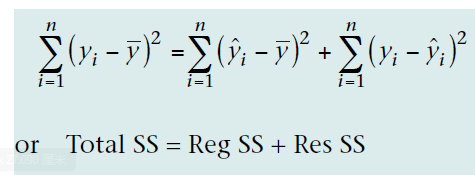


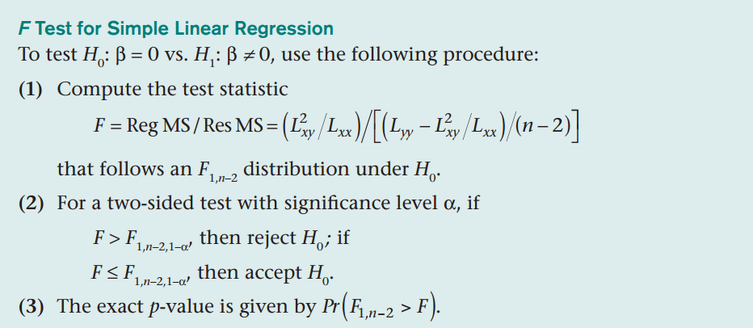


在使用R语言时，直接使用`aov()`对复杂模型和简化模型比较即可，看是否存在显著性差异，然后决定是否可以用简单模型替换复杂模型（之前提供的回归分析链接有实例）。

那么怎么评价模型拟合的好坏呢？这里有一个常见的参数。


### 非线性回归

回归的概念本质是说对数据进行曲线拟合，除了线性关系，科研中我们还会碰到其他因变量与自变量的定量关系，比如指数，幂函数等等。我们可以通过变换把它们转变为类似线性的关系，也就是非线性回归了。

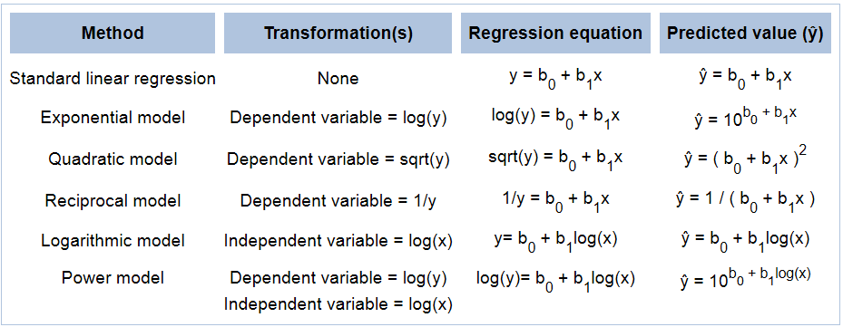

在R中，我们依旧使用`lm()`函数，这时，公式可以根据数据添加相应数学函数，比如`lm(log(y)~x)`实现指数函数的线性化，在绘图时，可以用`abline()`或`line()`函数添加拟合曲线（前者可以以模型作为参数输入）。

### 相关分析

相关系数公式        
$$
r=\frac{L{xy}}{\sqrt{L{xx}L{yy}}}=\frac{\sum(x-\overline{x})(y-\overline{y})}{\sqrt{\sum(x-\overline{x})^2 \sum(y-\overline{y})^2}}
$$
相关系数的平方为决定系数，表示为$R^2$，在拟合线性回归曲线时常常见到的参数就是这个。

r的取值从-1到1,0表示完全无关，绝对值越接近1，相关程度越高。

回归系数b与相关系数r的关系：
$$
b=\frac{Lxy}{Lxx}  \\
r=\frac{L{xy}}{\sqrt{L{xx}L{yy}}} \\
 r\sqrt{\frac{L_{yy}}{L_{xx}}}=b \\
$$

如果设$s_y^2=\frac{L_{yy}}{n-1}$，$s_x^2=\frac{L_{xx}}{n-1}$ (这不正是方差吗)
那么有$b=r\frac{s_y}{s_x}$


### 多元线性回归

多元线性回归可以看作是简单线性回归的一个拓展，回归系数和自变量不再是单个的，而是一组变量。

其公式形式为：
$$
y=a+b_1x_1+b_2x_2+\dots+b_nx_n
$$


其几何解释由简单的二元平面上的直线拟合变为多维空间中的直线拟合。

在各种数据参数的计算时可能公式会变得比较繁琐，但在使用R进行多元线性回归分析时，跟线性回归基本一致，使用`lm()`函数即可。

比如`lm(y~x1+x2)`可以进行二元线性回归，`lm(y~x1*x2)`加上交互项（x1与x2交叉因素）的探索。多维也是如此。

可以看到，这里b不再是一个值，而是多个。因此每一个自变量对于的b表示一个部分相关系数。它的含义为：一个预测变量（因变量）增加一个单位，其他预测变量保持不变时，因变量将要增加的数量。


举例：

探究出生重量(x1)和年龄对血压(x2)的影响，如果$y=53.45+0.1256x_1+5.888*x_2$，（原始数据未列出，仅关注计算）那么


我们可以得到以下结果：


拟合优度的判断：

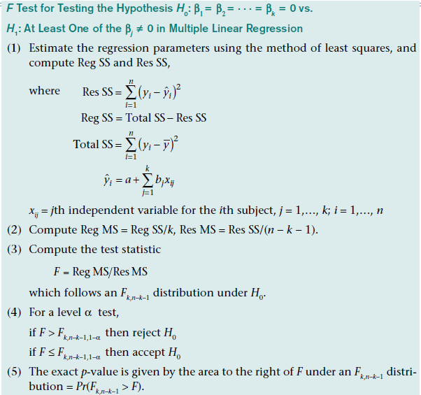

### 逻辑回归

[Logistic回归](http://blog.csdn.net/pakko/article/details/37878837)与多重线性回归实际上有很多相同之处，最大的区别就在于它们的因变量不同，其他的基本都差不多。正是因为如此，这两种回归可以归于同一个家族，即广义线性模型（generalizedlinear model）。

这一家族中的模型形式基本上都差不多，不同的就是因变量不同。

- 如果是连续的，就是多重线性回归；
- 如果是二项分布，就是Logistic回归；
- 如果是Poisson分布，就是Poisson回归；
- 如果是负二项分布，就是负二项回归。

Logistic回归的因变量可以是二分类的，也可以是多分类的，但是二分类的更为常用，也更加容易解释。所以实际中最常用的就是二分类的Logistic回归。

Logistic回归的主要用途：

- 寻找危险因素：寻找某一疾病的危险因素等；
- 预测：根据模型，预测在不同的自变量情况下，发生某病或某种情况的概率有多大；
- 判别：实际上跟预测有些类似，也是根据模型，判断某人属于某病或属于某种情况的概率有多大，也就是看一下这个人有多大的可能性是属于某病。

Logistic回归主要在流行病学中应用较多，比较常用的情形是探索某疾病的危险因素，根据危险因素预测某疾病发生的概率，等等。例如，想探讨胃癌发生的危险因素，可以选择两组人群，一组是胃癌组，一组是非胃癌组，两组人群肯定有不同的体征和生活方式等。这里的因变量就是是否胃癌，即“是”或“否”，自变量就可以包括很多了，例如年龄、性别、饮食习惯、幽门螺杆菌感染等。自变量既可以是连续的，也可以是分类的。

 通过对数据发生概率进行logit转换，我们可以生成线性的逻辑回归模型。


图形化的效果为：


由此得到逻辑回归模型：


在R中，逻辑回归作为广义线性模型的一部分被介绍，可以参考我整理的[广义线性模型](https://moiedotblog.wordpress.com/2017/05/12/%e5%b9%bf%e4%b9%89%e7%ba%bf%e6%80%a7%e6%a8%a1%e5%9e%8b/)。下面列出常用的连接函数和连用函数。

### glm()函数

基本形式：`glm(formula, family=family(link=function), data=)`

| 分布族              | 默认的连接函数                                  |
| ---------------- | ---------------------------------------- |
| binomial         | (link = “logit”)                         |
| gaussian         | (link = “identity”)                      |
| gamma            | (link = “inverse”)                       |
| inverse.gaussian | (link = “1/mu^2”)                        |
| poisson          | (link = “log”)                           |
| quasi            | (link = “identity”, variance=”constant”) |
| quasibinomial    | (link = “logit”)                         |
| quasipoisson     | (link = “log”)                           |

glm()函数可以拟合许多流行的模型，包括Logistic回归、泊松回归和生存分析。

### 连用的函数

与glm()函数连用的一些函数

| 函数                     | 描述                  |
| ---------------------- | ------------------- |
| summary()              | 展示拟合模型的细节           |
| coefficients(), coef() | 列出拟合模型的参数（截距项和斜率）   |
| confint()              | 给出模型参数的置信区间（默认为95%） |
| residuals()            | 列出拟合模型的残差值          |
| anova()                | 生成两个拟合模型的方差分析表      |
| plot()                 | 生成评价拟合模型的诊断图        |
| predict()              | 用拟合模型对新数据集进行预测      |
| deviance()             | 拟合模型的偏差             |
| df.residual()          | 拟合模型的残差自由度          |

具体实例可以参考[逻辑回归的一个简单实例](https://moiedotblog.wordpress.com/2017/05/18/%e9%80%bb%e8%be%91%e5%9b%9e%e5%bd%92%e7%9a%84%e4%b8%80%e4%b8%aa%e7%ae%80%e5%8d%95%e5%ae%9e%e4%be%8b/)。

### 部分相关与多重相关

部分相关，也称为偏相关。偏相关分析是指当两个变量同时与第三个变量相关时，将第三个变量的影响剔除，只分析另外两个变量之间相关程度的过程。


多重相关就是整体的相关系数r。


